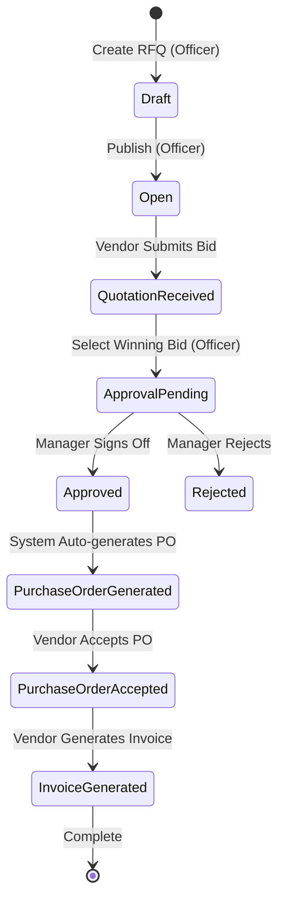

# Brief Details & Workflow Guide

PurchaseHub is an Odoo-inspired ERP module designed to streamline corporate procurement workflows by providing a structured, secure interface for managing RFQs, vendor bids, manager approvals, purchase orders, and invoices.

---

## 1. Core Workflows Lifecycle

The application automates the full procurement cycle, transitioning records cleanly through the following states:

---

## 2. Role Assignments & Permissions

The application supports four user roles, mapped as follows:

| Role | Permissions & Workflow Responsibility |
|---|---|
| **Procurement Officer** | Creates RFQs, assigns vendors, reviews bids, selects winning proposals, and creates manual vendor accounts. |
| **Finance Manager** | Audits procurement reports and signs off (Approves/Rejects) on selected quotation bids. |
| **Vendor Partner** | Views assigned RFQs, submits quotation bids, accepts generated Purchase Orders, and generates Invoices. |
| **Administrator** | Full system permissions including dashboard access, registry management, settings control, and database updates. |

---

## 3. Core Business Logic Details
- **Manager Sign-off Threshold**: Can be configured in Settings. Bids exceeding the threshold require manager signature; below that, they can bypass approvals if auto-PO is enabled.
- **GST Taxation**: Standardized at 18% GST (common Indian tax tier for IT services and hardware items).
- **Audit Trails**: Every login, registration, RFQ publication, quotation submission, manager approval, PO dispatch, and invoice generation is recorded in the activity log database.
