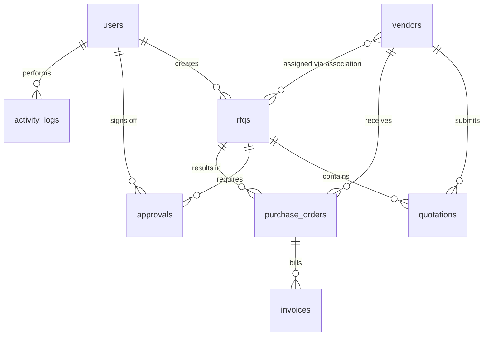

# Database Schema Specifications

The PurchaseHub ERP module utilizes a portable relational database (SQLite) managed via SQLAlchemy ORM.

---

## Entity Relationship Summary

The schema consists of:
- Core operational tables (`users`, `vendors`, `rfqs`, `quotations`, `approvals`, `purchase_orders`, `invoices`, `activity_logs`).
- A join table (`rfq_vendor_association`) establishing a **Many-to-Many** relationship between `rfqs` and `vendors` to represent vendor assignments.

---

## 1. Table Specifications

### `users`
Represents ERP accounts (employees, officers, managers, and vendor accounts).
- **Primary Key**: `id` (`Integer`, Autoincrement)
- **Attributes**:
  - `name`: `String` (User full name)
  - `email`: `String` (Unique, Indexed, used as username)
  - `password_hash`: `String` (PBKDF2-HMAC-SHA256 hashed password)
  - `role`: `String` (Role values: `Admin`, `Procurement Officer`, `Manager`, `Vendor`)
  - `created_at`: `DateTime` (Default: UTC Now)

---

### `vendors`
Profiles of vendor partners participating in procurement.
- **Primary Key**: `id` (`Integer`, Autoincrement)
- **Attributes**:
  - `company_name`: `String` (Unique registered legal company name)
  - `gst_number`: `String` (Unique 15-character GSTIN number)
  - `category`: `String` (e.g. `IT Hardware`, `IT Infrastructure`, `General Procurement`)
  - `email`: `String` (Contact email matching the Vendor user account)
  - `phone`: `String` (Indian phone formatting +91)
  - `address`: `Text` (Registered headquarters office details)
  - `rating`: `Float` (Quality rating score from 0.0 to 5.0)
  - `status`: `String` (Status: `Active`, `Pending`, `Suspended`)
  - `created_at`: `DateTime`

---

### `rfqs`
Request for Quotations representing items/quantities needed.
- **Primary Key**: `id` (`Integer`, Autoincrement)
- **Attributes**:
  - `title`: `String` (Short specification summary)
  - `description`: `Text` (Technical requirements details)
  - `quantity`: `Integer` (Quantity required)
  - `deadline`: `DateTime` (Bidding expiration timeline)
  - `status`: `String` (Workflow state: `Draft`, `Open`, `Quotation Received`, `Approval Pending`, `Approved`, `Rejected`)
  - `attachment_name`: `String` (Attached PDF specifications datasheet)
  - `attachment_url`: `String` (S3/Cloud storage path)
  - `selected_quotation_id`: `Integer` (Foreign key placeholder for winning quote)
  - `created_by`: `Integer` (Foreign Key -> `users.id`)
  - `created_at`: `DateTime`

---

### `quotations`
Vendor submitted pricing proposals for assigned RFQs.
- **Primary Key**: `id` (`Integer`, Autoincrement)
- **Attributes**:
  - `rfq_id`: `Integer` (Foreign Key -> `rfqs.id`, Cascade ondelete)
  - `vendor_id`: `Integer` (Foreign Key -> `vendors.id`, Cascade ondelete)
  - `price`: `Float` (Total bid amount in Rs.)
  - `delivery_days`: `Integer` (Lead delivery timeframe in days)
  - `notes`: `Text` (Remarks, specs exceptions, warranty support terms)
  - `submitted_at`: `DateTime`

---

### `approvals`
Manager's approval/rejection decisions on selected winning quotations.
- **Primary Key**: `id` (`Integer`, Autoincrement)
- **Attributes**:
  - `rfq_id`: `Integer` (Foreign Key -> `rfqs.id`, Cascade ondelete)
  - `manager_id`: `Integer` (Foreign Key -> `users.id`)
  - `remarks`: `Text` (Manager's remarks)
  - `status`: `String` (`Approved` or `Rejected`)
  - `approved_at`: `DateTime`

---

### `purchase_orders`
Issued PO documents resulting from approved quotations.
- **Primary Key**: `id` (`Integer`, Autoincrement)
- **Attributes**:
  - `po_number`: `String` (Unique PO Identifier: `PO-YYYY-RANDOM`)
  - `rfq_id`: `Integer` (Foreign Key -> `rfqs.id`, Cascade ondelete)
  - `vendor_id`: `Integer` (Foreign Key -> `vendors.id`)
  - `amount`: `Float` (Amount in Rs.)
  - `status`: `String` (Status: `Generated`, `Sent`, `Accepted`)
  - `created_at`: `DateTime`

---

### `invoices`
Vendor billing invoices generated against accepted POs.
- **Primary Key**: `id` (`Integer`, Autoincrement)
- **Attributes**:
  - `invoice_number`: `String` (Unique invoice number: `INV-YYYY-RANDOM`)
  - `po_id`: `Integer` (Foreign Key -> `purchase_orders.id`, Cascade ondelete)
  - `subtotal`: `Float` (Amount before taxes in Rs.)
  - `tax`: `Float` (Tax amount in Rs., e.g., GST 18.0%)
  - `total`: `Float` (Grand total invoice amount in Rs.)
  - `status`: `String` (Status: `Unpaid`, `Paid`, `Overdue`)
  - `generated_at`: `DateTime`

---

### `activity_logs`
System-wide audit logs trail tracking CRUD activities, logins, and notifications.
- **Primary Key**: `id` (`Integer`, Autoincrement)
- **Attributes**:
  - `user_id`: `Integer` (Foreign Key -> `users.id`, nullable for system actions)
  - `action`: `String` (Descriptive audit sentence)
  - `timestamp`: `DateTime`

---

## 2. Many-to-Many Association

### `rfq_vendor_association`
Binds RFQs and Vendors.
- `rfq_id`: `Integer` (Foreign Key -> `rfqs.id`, cascade delete)
- `vendor_id`: `Integer` (Foreign Key -> `vendors.id`, cascade delete)
- **Composite Primary Key**: (`rfq_id`, `vendor_id`)
